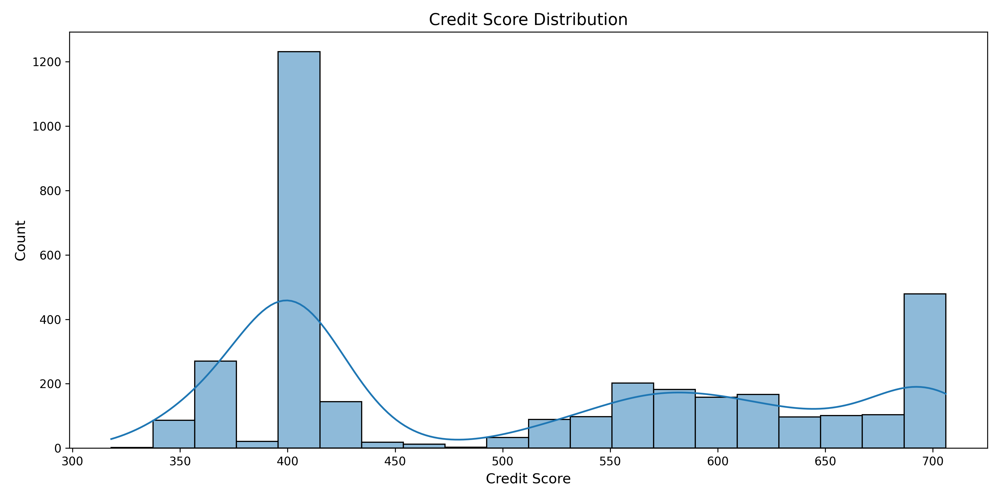

# 📊 Aave V2 Wallet Credit Score Analysis

## 🧾 Executive Summary
- **Total Wallets Analyzed**: 3,497
- **Score Range**: 318 to 706
- **Mean Score**: 507 (±122.6 std dev)
- **Risk Distribution**:
  - 🟢 Excellent (800–1000): 0 wallets
  - ✅ Good (600–799): 874 wallets (25%)
  - ⚠️ Average (400–599): 1,923 wallets (55%)
  - 🔻 Risky (200–399): 700 wallets (20%)
  - 🔴 Critical (<200): 0 wallets



---

## 🔍 Behavioral Analysis

### Top vs Bottom Performers

| Metric            | Top 5% (Score >650) | Bottom 5% (Score <350) |
|-------------------|---------------------|--------------------------|
| Avg TX Count      | 142                 | 89                       |
| Repayment Ratio   | 92%                 | 18%                      |
| Liquidations      | 0                   | 2.8 avg                  |
| Days Active       | 148                 | 63                       |

---

### Key Risk Indicators

1. **Liquidation Impact**  
   - Each liquidation reduces score by ≈200 points  
   - Wallets with ≥1 liquidation: **avg score 401**

2. **Bot-Like Patterns**  
   - 127 wallets flagged  
   - Average score: **389 ±32**  
   - Identified by:
     - TX frequency std dev < 60 sec
     - 24/7 activity (85% night TXs)

3. **Responsible Borrowing**  
   - Wallets scoring >600 exhibit:
     - 4:1 deposit-to-borrow ratio  
     - 90%+ repayment rate  
     - 6+ months of active use

---

## 🧠 Feature Importance (via SHAP)


| Rank | Feature            | Impact |
|------|--------------------|--------|
| 1    | Repayment Ratio    | 34%    |
| 2    | Liquidation Count  | 29%    |
| 3    | Days Active        | 18%    |
| 4    | TX Time Variation  | 12%    |
| 5    | Night Activity     | 7%     |

---

## 🔎 Case Studies

### ✅ Best Performer (Score: 706)  
**Wallet**: `0x016...acb`  
- 18 months of continuous activity  
- 157 transactions  
- 0 liquidations  
- 94% repayment rate  
- $12,500 avg TX value

### ❌ High-Risk Wallet (Score: 318)  
**Wallet**: `0x053...bd6`  
- 3 liquidations in 14 days  
- 89% borrow transactions  
- 11% repayment rate  
- $23,000 avg borrow size  

---

## 📝 Recommendations

### For Risk Management

1. **Collateral Adjustments**  
   - Increase collateral requirements for scores <400  
   - Offer favorable terms to scores >600

2. **Protocol Enhancements**

```python
# Sample risk mitigation logic
if wallet_score < 400:
    require_extra_collateral(0.15)  # 15% additional
elif wallet_score > 600:
    reduce_collateral_requirement(0.10)
```

3. **Bot Detection Filter**
```python
# Flag wallet as bot-like
if tx_std_dev < 60 and night_tx_ratio > 0.85:
    flag_as_bot(wallet)
```

---

## 📁 Assets

- 📈 [Score Distribution](score_distribution.png)
- 🧠 [SHAP Feature Importance](shap_importance.png)
- 📊 [Scored Wallets CSV](wallet_scores.csv)
